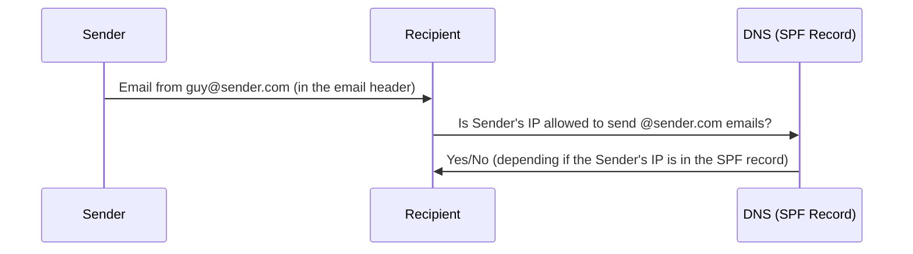

## Introduction

It is unbelievable how many companies are vulnerable to receiving undetected _spoofed emails_ and how much damage this could mean for them. For those who don't know, a spoofed email is an email sent by somebody in the name of somebody else. For example our company ACME Inc is vulnerable to undetected email spoofing, that means that an attacker Eve can send an email with any content in the name of the trustworthy Bob's email address `bob@trusted.com` without ACME or Bob noticing it.

In this post I will explain how email authentication works, how to bypass it (in many cases) and how to protect your server. We will also see a pratical example on how to send a spoofed email, by the end of this post you should be able to quickly identify a domain vulnerable to email spoofing and craft spoofed emails. Enjoy!

## Am I vulnerable?

Before diving in the details of how email spoofing work, you might want to know if your company is vulnerable. In our considerations we will use the domain `comune.quarto.na.it` because I found it to be vulnerable, you can use your preferred domain instead. If you are on Linux simply run

```bashexam
dig _dmarc.comune.quarto.na.it TXT | grep _dmarc.comune.quarto.na.it
```

I get

```
; <<>> DiG 9.20.4 <<>> _dmarc.comune.quarto.na.it TXT
;_dmarc.comune.quarto.na.it. IN TXT
_dmarc.comune.quarto.na.it. 3446 IN TXT "v=DMARC1; p=none; adkim=r; aspf=r;"
```

and the interesting part is the string `v=DMARC1; p=none`, that indicates your domain is vulnerable to receiving undetected spoofed emails, if the output is empty it means that you don't have any DMARC Policy at all (same problem). If you're not on Linux, you can use a DMARC online scanner tool like [this one](https://mxtoolbox.com/dmarc.aspx) and check if the tool reports your DMARC Policy is ok.

## How email authentication works

As you probably know DNS is made up of different records, they are supposed to describe almost everything you need to know about your domain, including what is your email server's IP, which IPs are authorized to send emails with your domain (SPF Policy) and you handle incoming emails (DMARC Policy).

In Linux you can lookup different DNS records with the `dig` command, that follows this syntax

```
dig some.domain TYPE
```

where `TYPE` is the DNS record type you're looking for and `some.domain` is the domain you're performing the lookup on. Some common DNS record types are: `A`, `MX`, `TXT`, you can see many more on [this list on Wikipedia](https://en.wikipedia.org/wiki/List_of_DNS_record_types).

### SPF

It sets the policy for outcoming emails (actually how other servers can check your email is authentic, so that it comes from you).

SPF is a way to let other servers knows which IP addresses are authorized to send messages with their domain.

Take a look at the following diagram.



If Bob is the sender and ACME is the receiver, then protocol works like this:

1. Bob sends an email to ACME at `ceo@acme.com` with his email address `bob@trusted.com`
2. ACME's mail server asks its DNS server the SPF record for `trusted.com`
3. If the SPF record contains Bob's IP, then Bob's email is authentic, otherwise it's rejected

So far it seems like this authentication protocol works, right? Well, in this form, it's very easy to break it, because this check is only "partial". An email is made up of an Email Header and an Email Content, the header contains a field named `mail from`, while the content contains a `from` field, they both should indicate which email address is the sender, but only `mail from` is checked by SPF! Moreover, by default, email clients only show the Email Content to the user.

It's easy now to see where we want to go. What happens if the `mail from` is considered valid by SPF but it doesn't match the `from` field? In this case the recipient will receive a an email with a sender that looks like it is the one reported in the `from` field but actually it's the one in the `mail from` field. This is email spoofing!

To overcome this limitation of SPF, the DMARC Policy is used.

### DMARC

It sets the policy for incoming emails.

Nobody uses it, let's take a list of domains and see how many have this not well implemented.

### DKIM

It signs email messages

## Scan them all: finding vulnerable targets

## Conclusion

> This post has solely educative purposes. I do not endorse, and I'm not responsible of, any illegal activity you might do. Stay legal.

# Your notes (don't publish this)

## Resources

- Video on how to set up an SMPT Relay (you should find a video on setting up an SMTP server) from a skilled a mail guy (but he uses Microsoft...): <https://www.youtube.com/watch?v=LbhOrr2iUmI>
