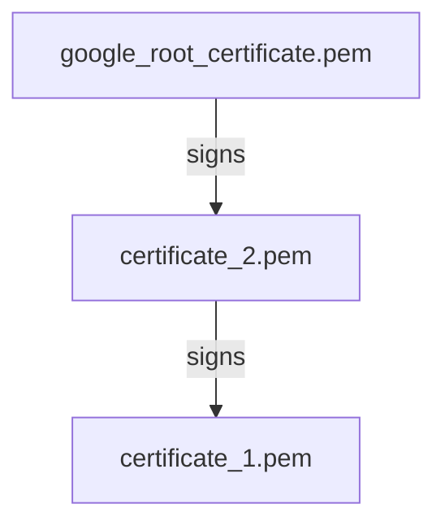

This is a guide on how to pass strong integrity checks on an Android device using Magisk. It contains with many explanations on what we're doing and why, it aims to be mostly self-contained. If you're on a rush you can skip the explanations and go to the [guide](#guide).

## How it works

Before listing the steps to get strong integrity on our device, let's understand what is the [Google Play Integrity API](https://developer.android.com/google/play/integrity/verdicts) and why we would want to pass its checks.

### What is the Google Play Integrity API

The Integrity API is a tool used by android developers to check the "security state" of an Android device and take steps in their app as a consequence, that usually is denying the user the access to the app itself, to some app function or just making the user aware of a possible risk.

The API returns [integrity verdicts](https://developer.android.com/google/play/integrity/verdicts) that contain some device details and some labels to that represent the integrity checks passed. At the time of writing there are 4 labels:

- `MEETS_BASIC_INTEGRITY`: the device passes some basic software integrity checks.
- `MEETS_DEVICE_INTEGRITY`: the device is "Play Protect certified". It passes an hardware proof that the bootloader is locked and the Android OS is certified by the manufacturer.
- `MEETS_STRONG_INTEGRITY`: the device passes `MEETS_DEVICE_INTEGRITY` checks and the Android OS has security patches released in the last year.
- `MEETS_VIRTUAL_INTEGRITY`: The device is running an Android emulator with Google Play services and passes some integrity checks. If you're not running an emulator, ex. you have an Android phone, this check should not be passed.

### What is Android certificate chain

[Android Keystore] provides a secure way to generate and store cryptographic keys for any purpose a developer might need them (ex: encrypting secrets in their app), the key generation is "certified" using a certification chain. On an Android device is stored a list of certificates:

- Google's root certificate: there's a list of [valid root certificates](https://developer.android.com/privacy-and-security/security-key-attestation#root_certificate), this is the most important certificate, it is only trusted one and all the others are trusted as a consequence of trusting this certificate.
- Another certificate signed by the previous certificate
- Possibly another certificate signed by the previous certificate
- ...
- Possibly another certificate signed by the previous certificate

So Google signs some other certificate (I guess created by some manufacturer or similar), that certificate can sign another certificate an so on. A certificate contains some metadata, cryptographic parameters and a public key, the private key shouldn't be disclosed otherwise an attacker could sign other certificates.

If a certificate is compromised in the chain, also the following certificate is compromised (and the next, and so on, up to the last certificate), breaking the trust in the chain.

So when a developer requests a new key pair to the Android Keystore, your device has to pass an [attestation challenge](https://source.android.com/docs/security/features/keystore/attestation#expandable-1) that requires your last certificate in the previous chain to sign a new certificate that contains some data generated by the developer (ideally randomly), that confirms that the key is safe to use. This last certificate is called [attestation certificate](https://source.android.com/docs/security/features/keystore/attestation#certificate-sequence) and the entire chain is called certificate chain. In order to pass the challenge the device needs to have the private key of the attestation certificate, that should be securely provisioned to your device when manufactured and almost impossible to extract.

Finally, to pass strong integrity checks your device needs to pass an attestation challenge.

#### Manual chain validity check

If you want, you can manually check the validity of the certificate chain stored on your device (without the attestation certificate, because that is generated at runtime). Let's say you have access to your certificates (because you can [set a `keybox.xml` file](#tools-used) for example) and you have 3 certificates: `google_root_certificate.pem`, `certificate_1.pem`, `certificate_2.pem`. You can reconstruct the chain by running

```sh
openssl x509 -in google_root_certificate.pem -noout -issuer -subject
openssl x509 -in certificate_2.pem -noout -issuer -subject
openssl x509 -in certificate_1.pem -noout -issuer -subject
```

you should get an output like this:

```
issuer=serialNumber=f92009e853b6b045
subject=serialNumber=f92009e853b6b045
issuer=serialNumber=f92009e853b6b045
subject=title=TEE, serialNumber=5123cde500ce919ba7c31cd6ea360c9e
issuer=title=TEE, serialNumber=5123cde500ce919ba7c31cd6ea360c9e
subject=title=TEE, serialNumber=8e28af352399e7c88a415cec8195a467
```

you can notice that the `issuer` and the `subject` fields are the same for the root contract and this means that it shouldn't be checked by any other contract, it should just be trusted. While the `issuer` field of `certificate_2` is the subject of `google_root_certificate` and the `issuer` of `certificate_1` is the `subject` of `certificate_2`. This means that `certificate_1` is signed by `certificate_2` that is signed by `google_root_certificate`, creating this chain:



To check that the chain is valid you can run this command

```sh
openssl verify -show_chain -CAfile google_root_certificate.pem -untrusted certificate_2.pem certificate_1.pem
```

and get

```
certificate_1.pem: OK
Chain:
depth=0: title=TEE, serialNumber=8e28af352399e7c88a415cec8195a467 (untrusted)
depth=1: title=TEE, serialNumber=5123cde500ce919ba7c31cd6ea360c9e (untrusted)
depth=2: serialNumber=f92009e853b6b045
```

don't worry about `untrusted`, it means that you're only trusting the `google_root_certificate` certificate and checking the signatures of all the others. Finally, if you have the private key `private_key.pem` of the last certificate, you can check it's right key by running

```sh
cmp <(openssl pkey -in private_key.pem -pubout) <(openssl x509 -in certificate_1.pem -pubkey -noout)
```

if you don't get any errors, it's correct.

### Why passing integrity checks

Users of custom ROMs and/or root users might easily fail integrity checks, making many apps not usable, typically banking apps.
In order to pass those checks they can hide/spoof/hack some device information.

### Tools used

These are the tools we will use, let's analyze them:

- [Magisk](https://github.com/topjohnwu/Magisk): a "systemless" root solution, it's used to install modules that will bypass integrity checks. There are many forks of Magisk, a well known one is [Kitsune Mask](https://github.com/1q23lyc45/KitsuneMagisk/blob/kitsune/docs/changes.md), but I couldn't use it because it's many versions behind the upstream Magisk.
- [Play Integrity Fork (PIFork)](https://github.com/osm0sis/PlayIntegrityFork): a module that helps passing the integrity checks (but alone it's not sufficient).
- [ReZygisk](https://github.com/PerformanC/ReZygisk): a fork of [Zygisk Next](https://github.com/Dr-TSNG/ZygiskNext/tree/698e6e6624e7b5aae47146d098b8853250aa4ae3) with a FOSS licence. Zygisk Next is a standalone implementation of [Zygisk](https://github.com/topjohnwu/Magisk/tree/master/native/src/core/zygisk), it was open source up to and excluding version 0.9.2, subsequently all rights have been reserved. Zygisk is a Magisk component that allows module developers to inject code at runtime that changes the applications and system behavior (see the [relevant comment in Zygisk](https://github.com/topjohnwu/Magisk/blob/master/native/src/core/zygisk/api.hpp) for more). Having a standalone program that implements the same Zygisk logic and has the same API is important because it can be reused by other root solutions (ex: ReZygisk can be used also by [KernelSU](https://github.com/tiann/KernelSU)). There's also [NeoZygisk](https://github.com/JingMatrix/NeoZygisk) that is similar to ReZygisk.
- [Tricky Store](https://github.com/5ec1cff/TrickyStore): a (now closed source) Zygisk module that allows to pass device integrity checks by hacking Android's certification chain. It's also possible to pass strong integrity by providing an unrevoked `keybox.xml` file that provides a genuine certificate chain. It's possible to apply Tricky Store to specific apps by manually setting a file `target.txt` (it's a list of app packages, one per line).
- [YuriKey](https://github.com/YurikeyDev/yurikey): sets the `keybox.xml` and `target.txt` files of `Tricky Store` automatically, it includes a genuine certificate chain in the `keybox.xml` file that gets periodically updated, because certificates [get revoked by Google](https://developer.android.com/privacy-and-security/security-key-attestation#certificate_status) if, for example, too many Play Integrity checks are done with that keybox.
- [NoHello](https://github.com/MhmRdd/NoHello): A module to hide root and Zygisk from apps. There are some alternatives like: [Shamiko](https://github.com/LSPosed/LSPosed.github.io/releases) (closed source), [Zygisk Assistant](https://github.com/snake-4/Zygisk-Assistant/releases).
- [Play Integrity API Checker](https://github.com/1nikolas/play-integrity-checker-app): App that performs integrity checks using the Play Integrity API.
- [Key Attestation](https://github.com/VisionR1/KeyAttestation): App that checks that tests the device ability to pass attestation challenges and gives details on the certificates.

## Guide

This guide requires a rooted phone, if you don't want have a rooted phone and you are using in a custom ROM that allows to set a custom `keybox.xml` file, you can check [a rootless integrity fix guide](https://github.com/yadavnikhil03/Play-integrity-fix-guide/blob/main/guide/keybox_guide.md).

To get strong integrity do this:

- Install the latest version of Magisk
- Inside Magisk:
  - Hide Magisk: a feature that creates a "proxy app" with an arbitrary name to hide Magisk
  - Configure denylist (don't press "Enforce denylist") and add: Google Play Services, Google Play Store, Google Services Framework and any app you want to hide root from.
  - Install these modules: ReZygisk. Reboot. Play Integrity Fork, Tricky Store, YuriKey, NoHello. Reboot.
  - Run actions for these modules: Play Integrity Fork, Tricky Store (grant root)
- In KsuWebUI (comes with Tricky Store), select Tricky Store (the first time usually this step is already done for you), click on the hamburger menu and press:
  - Select All -> Deselect Unecessary -> Set Security Patch -> Get Security Patch Date -> Save
<!--   - Set Valid Keybox (I don't know if this step is actually useful - TODO: CHECK) -->
<!-- Finally hit Save. -->
- Run YuriKey action in Magisk
- Reboot and check your integrity using: [Play Integrity API Checker](https://github.com/1nikolas/play-integrity-checker-app) and [Key Attestation](https://github.com/VisionR1/KeyAttestation)

You should now pass all the integrity tests.

### There's more

Here are some extra tools you might want to install:

- [JingMatrix's LSPosed](https://github.com/JingMatrix/LSPosed): LSPosed is replacement of Xposed, an advanced framework for modules that can change system and apps without editing APKs. There are infact Xposed modules (that are not Magisk modules).
- [Hide My Applist (HMA)](https://github.com/Dr-TSNG/Hide-My-Applist): an Xposed module that denies or spoofs app list requests from apps. The idea is that an app can detect root by getting the list of installed apps, if an app that requires root is installed, then it's very likely that the device is rooted.
- [Android-Native-Root-Detector](https://github.com/reveny/Android-Native-Root-Detector): an app to check root detection.
- [BetterKnowInstalled](https://github.com/Pixel-Props/BetterKnownInstalled): module that avoids the `UNKNOWN_INSTALLED` status in DroidGuard.
- [Zygisk detach](https://github.com/j-hc/zygisk-detach): a module used to prevent the Play Store to automatically update apps, even if the auto update feature is turned off. It is useful to lock a problematic app version if a working setup was found.
<!-- - Try [Apatch](https://github.com/bmax121/APatch): it is a new rooting method with some advantages over KernelSU and Magisk, my device wasn't compatible but might be worth checking it out, it won't be compatible with this guide tho (not fully at least). -->

<!-- Not used stuff: -->
<!-- <https://github.com/B1ays/BootloaderSpoofer-fork> -->
<!-- <https://github.com/EricInacio01/PlayIntegrityFix-NEXT> -->

## Final words

Years ago [Google started a war](https://xdaforums.com/t/discussion-the-root-and-mod-hiding-fingerprint-spoofing-keybox-stealing-cat-and-mouse-game.4425939/) to modding, over time this made the experience very frustrating and I think this is preventing many people to try modding or even to roll back to a stock setup, as consequence I feel like the community is slowly dying. Modding is risky (it can get your bank account frozen for example, personal experience...), but the price is usually a more powerful, more private and more free phone.

Peace.
